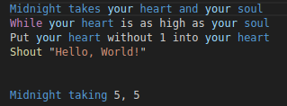
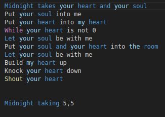
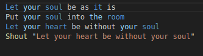
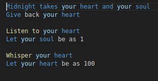

# verification-course

## Тестирование расширения для подсветки языка Rockstar https://github.com/ra100/vscode-rockstar-language

### Case1

Корректно подсветились: имя функции; операторы while и shout; имена переменных

Некорректно подсветились: оператор `Put`

### Case2

Корректно подсветились: имя функции; операторы let, while и shout; имена переменных (почти все)

Некорректно подсветились: переменнная `me`

### Case3

Корректно подсветились: операторы let и shout; имена переменных; символьная строка

Некорректно подсветились: слово `it` в первой строке

### Case4

Корректно подсветились: имя функции; операторы let, listen to & whisper; имена переменных

Некорректно подсветились: -